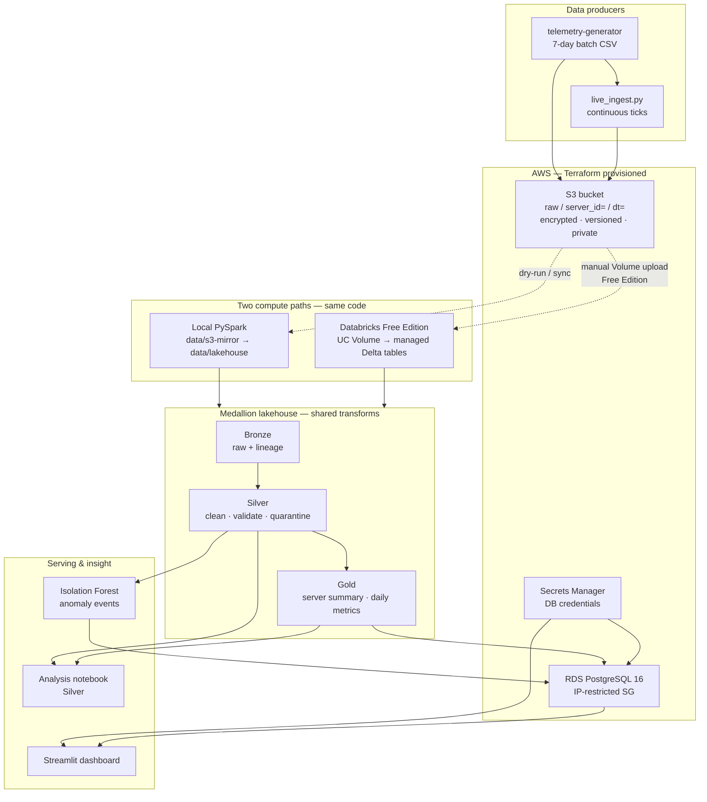

# Cloud Telemetry Analytics Platform

A small end-to-end cloud telemetry analytics platform: synthetic infrastructure metrics are generated, ingested into AWS S3, processed through a Bronze → Silver → Gold Delta lakehouse (locally with PySpark and on Databricks Free Edition), served into PostgreSQL, scored by an Isolation Forest anomaly detector, analysed in a notebook, and displayed in a Streamlit dashboard.

AI tools were used during development. The solution below is what was built and what should be explainable in review.

---

## Architecture



**How to read it**

1. Batch and continuous producers write Hive-partitioned Parquet into **S3** (Terraform).
2. The **same** Bronze → Silver → Gold logic runs locally (PySpark + Delta) and on **Databricks Free Edition** (Volume input → Catalog tables). Free Edition cannot read private S3 from serverless, so raw data is copied into a Unity Catalog Volume once.
3. **Postgres** is the serving layer (health summary, alerts, ML anomalies). Credentials come from **Secrets Manager**, never from source code.
4. **Streamlit** reads only Postgres. The **analysis notebook** and **Isolation Forest** read Silver (local Delta); ML events are loaded into Postgres separately.

| Path | Compute | Raw input | Lakehouse output |
|------|---------|-----------|------------------|
| **Local** | Laptop PySpark | `data/s3-mirror/raw` | `data/lakehouse/*` |
| **Databricks** | Free Edition serverless | Unity Catalog Volume | Managed Delta tables |

Postgres, ML, and Streamlit use the **local** Gold/Silver path. Databricks demonstrates the medallion pipeline on the required platform.

---

## Technologies

| Layer | Choice |
|-------|--------|
| Cloud | AWS (`ap-southeast-1`) |
| IaC | Terraform |
| Object storage | S3 (versioned, encrypted, public access blocked) |
| Lakehouse | Delta Lake + PySpark; Databricks Free Edition |
| Database | Amazon RDS PostgreSQL 16 |
| Secrets | AWS Secrets Manager |
| Data science | Pandas, Matplotlib, Jupyter |
| ML | Scikit-learn Isolation Forest |
| Dashboard | Streamlit |
| Source control | GitHub |

---

## Repository layout

```text
cloud-telemetry-analytics-yanghan/
├── terraform/                 # S3, RDS, security group, Secrets Manager
├── telemetry-generator/       # Synthetic 7-day fleet data (+ DQ defects)
├── ingestion/
│   ├── ingest.py              # Batch CSV → partitioned Parquet → S3 / local mirror
│   └── live_ingest.py         # Continuous tick → same partition layout
├── notebooks/
│   ├── bronze.py / silver.py / gold.py   # Local lakehouse jobs
│   ├── telemetry_analysis.ipynb          # Data science notebook
│   └── databricks/            # Databricks runners (import local transforms)
├── database/                  # schema.sql + Gold → Postgres loader
├── ml/                        # Isolation Forest + anomalies → Postgres
├── app/streamlit_app.py       # Dashboard
├── tests/test_silver.py       # Silver validation unit tests
└── requirements.txt
```

---

## Prerequisites

- Python 3.11+
- AWS account + credentials (`aws configure` or env vars)
- Terraform ≥ 1.5
- Java 11+ (for local PySpark)
- Optional: Databricks Free Edition account (for the Databricks notebooks)

```bash
python -m venv venv
# Windows PowerShell:
.\venv\Scripts\Activate.ps1
pip install -r requirements.txt
```

---

## 1. Deploy cloud infrastructure (Terraform)

```bash
cd terraform
```

Create `terraform.tfvars` (do **not** commit it — add to `.gitignore` if not already):

```hcl
allowed_ip_cidr = "YOUR.PUBLIC.IP.ADDRESS/32"   # curl checkip.amazonaws.com
```

```bash
terraform init
terraform plan
terraform apply
terraform output
```

Resources created:

- S3 bucket for raw telemetry
- RDS PostgreSQL (`db.t4g.micro`)
- Security group allowing Postgres **only** from `allowed_ip_cidr`
- Secrets Manager secret `cloud-telemetry/db-credentials` (username, password, host, port, dbname)

**Databricks is not provisioned by Terraform.** Free Edition is Databricks-hosted SaaS and cannot be created with `databricks_mws_workspaces` (that deploys a paid workspace into your AWS account). See the comment block at the top of `terraform/main.tf`. Lakehouse jobs run on Free Edition via Git folders + a Unity Catalog Volume instead.

After apply:

```powershell
$env:TELEMETRY_S3_BUCKET = (terraform output -raw s3_bucket_name)
$env:TELEMETRY_DB_SECRET_NAME = "cloud-telemetry/db-credentials"
```

---

## 2. Generate telemetry

```bash
cd telemetry-generator
python generate_telemetry.py
```

Produces `data/telemetry_raw.csv`:

- **10 servers × 7 days × 5-minute interval** (~20,160 clean rows)
- Diurnal load pattern on CPU / network
- Six injected **behavioural** anomalies (CPU spike, memory leak, disk fill, network surge, error spike, slow response)
- ~40 injected **data-quality** defects (duplicates, nulls, out-of-range CPU, negatives, bad timestamps) so Silver’s validation rules actually fire
- `is_injected_anomaly` ground truth for ML evaluation only — never used as a model feature

Shared generation logic lives in `telemetry_model.py` (also used by continuous ingest).

---

## 3. Ingest telemetry

### Batch (historical week)

```bash
cd ingestion

# Local dry-run (writes data/s3-mirror/raw) — enough for Bronze without AWS
python ingest.py --dry-run

# Real S3 upload
python ingest.py
```

Writes Hive-partitioned Parquet: `server_id=X/dt=YYYY-MM-DD/*.parquet`.

### Continuous (optional)

```bash
# Demo: 3 ticks, 10 seconds apart, local
python live_ingest.py --dry-run --interval-seconds 10 --max-ticks 3

# Live to S3 every 5 minutes until Ctrl+C
python live_ingest.py
```

Satisfies “telemetry can continuously enter the platform” without changing the seeded historical dataset the notebook and ML metrics are scored against.

---

## 4. Lakehouse (local)

Run each script from `notebooks/` (paths are relative to that directory):

```bash
cd notebooks
python bronze.py    # raw Parquet → data/lakehouse/bronze
python silver.py    # clean / validate / quarantine → silver + telemetry_rejects
python gold.py      # aggregates → gold_server_summary + gold_daily_metrics
```

Expected Silver outcome with current generator:

- Bronze: **20,200** rows  
- Silver valid: **20,160**  
- Rejected: **29** (named reasons in `telemetry_rejects`)

### Databricks Free Edition

1. Clone this repo under **Workspace → Repos**.
2. Create a Unity Catalog Volume; upload the contents of `data/s3-mirror/raw/` so paths look like  
   `/Volumes/workspace/default/telemetry/raw/server_id=.../dt=.../`.
3. Open and **Run All**, in order:
   - `notebooks/databricks/01_bronze.py`
   - `notebooks/databricks/02_silver.py`
   - `notebooks/databricks/03_gold.py`
4. Set widget `repo_path` to your clone path (e.g. `/Workspace/Users/<you>/cloud-telemetry-analytics-yanghan`).
5. Tables appear in Catalog: `telemetry_bronze`, `telemetry_silver`, `telemetry_rejects`, `telemetry_gold_*`.

Free Edition cannot attach an IAM instance profile to serverless compute, so Bronze reads the Volume copy of raw data rather than `s3a://` live. On a paid workspace with an instance profile, only the input path would change; the transforms stay the same.

---

## 5. PostgreSQL serving layer

```bash
cd database
python load_to_postgres.py
```

Applies `schema.sql` and loads:

- `servers`
- `server_health_summary` (from Gold)
- `alerts` (derived from health score thresholds)

Then load ML anomaly events (after step 7):

```bash
cd ml
python load_anomalies_to_postgres.py
```

Credentials are fetched from Secrets Manager at runtime — never hardcoded.

---

## 6. Data analysis notebook

```bash
cd notebooks
jupyter lab telemetry_analysis.ipynb
```

Answers the assessment questions on **Silver** (not Bronze/Gold): highest CPU, errors, gradual memory/disk growth, unusual network, CPU vs response time, anomaly ranking, time-of-day patterns. Findings are written in the notebook markdown cells.

---

## 7. Anomaly detection

```bash
cd ml
python anomaly_detection.py
```

**Method:** Isolation Forest (multivariate, unsupervised, no Gaussian assumption).

**Features:** CPU, memory, disk, network Rx/Tx, log1p(error count), response time, plus 24h rolling memory/disk slopes (needed for gradual leaks/fills).

**Scaling:** Per-server robust z-score (median / MAD). Empirically much better than mean/std on this data (F1 ≈ 0.67 vs ≈ 0.26).

**Against injected ground truth** (same week):

| Detector | Precision | Recall | F1 |
|----------|-----------|--------|-----|
| Rule-based `status` thresholds | 1.00 | 0.16 | 0.27 |
| Isolation Forest | 0.66 | 0.69 | 0.67 |

Outputs:

- `data/ml/anomaly_results.parquet` — row-level scores  
- `data/ml/anomaly_events.parquet` — collapsed incidents for Postgres  
- `ml/model/isolation_forest.joblib` — model + scalers (gitignored)

---

## 8. Streamlit dashboard

```bash
cd app
streamlit run streamlit_app.py
```

Reads **only PostgreSQL** (fleet KPIs, utilization charts, health table, ML anomalies, alerts). Credentials via Secrets Manager or optional `TELEMETRY_DATABASE_URL`.

If connection fails: check RDS is up, your public IP still matches `allowed_ip_cidr`, and AWS credentials work (`aws sts get-caller-identity`).

---

## Data flow (end-to-end)

1. `generate_telemetry.py` → CSV  
2. `ingest.py` / `live_ingest.py` → S3 (and/or local mirror)  
3. `bronze.py` → raw Delta + lineage columns  
4. `silver.py` → validated Delta; rejects quarantined  
5. `gold.py` → server summary + daily metrics  
6. `load_to_postgres.py` → serving tables + alerts  
7. `anomaly_detection.py` → events → `load_anomalies_to_postgres.py`  
8. `streamlit_app.py` → operators  

Databricks path: same transforms, Volume input, Catalog tables output (parallel demonstration of the lakehouse on Databricks).

---

## Security considerations

- No passwords or AWS keys in source code.
- RDS password generated by Terraform and stored only in Secrets Manager.
- Terraform state (contains secrets) is gitignored — never commit `*.tfstate`.
- S3: versioning, SSE-S3 encryption, all public access blocked.
- RDS: publicly reachable only from a single `/32` CIDR.
- Known weaknesses (honest):
  - Local Terraform state on disk (solo project; production would use remote state + locking).
  - RDS is publicly accessible (IP-restricted); private subnets + bastion would be better.
  - Databricks Free Edition requires a manual Volume upload of raw data (no live S3 instance profile).
  - `allowed_ip_cidr` in `terraform.tfvars` must stay out of git.

---

## Tests

```bash
pytest tests/ -v
```

`tests/test_silver.py` covers validation rules and the standardize-before-deduplicate regression (case-variant `server_id` collapsing to one row).

Local lint (same as CI):

```bash
pip install ruff
ruff check app database ingestion ml notebooks telemetry-generator tests
```

---

## CI / DevSecOps (GitHub Actions)

On every push and pull request to `master`/`main`, [`.github/workflows/ci.yml`](.github/workflows/ci.yml) runs:

| Job | What it does |
|-----|----------------|
| **Python lint** | Ruff (`pyproject.toml`) |
| **Unit tests** | `pytest` with Java 17 for PySpark |
| **Dependency scan** | `pip-audit` against `requirements.txt` |
| **Secret scan** | Gitleaks (full git history) |
| **Terraform validation** | `terraform fmt -check`, `init -backend=false`, `validate` |

No cloud credentials are required; Terraform does not plan/apply in CI. Deployment stays manual (`terraform apply` locally).

---

## Problems encountered

1. **Silver never rejected anything** until data-quality defects were injected into the generator — validation code with a 0% fire rate is unverified.
2. **Deduplicate-before-standardize bug** — differently cased `server_id` values survived as duplicates; fixed by reordering Silver and covered by a unit test.
3. **Local ingest silent overwrite** on case-insensitive filesystems (fixed unique Parquet filenames + drop redundant partition columns).
4. **Windows Spark networking** — bind driver to `127.0.0.1`.
5. **Naive timestamps → 8h UTC shift** when Spark interpreted them in the session timezone — **fixed**: generator emits UTC-aware timestamps; ingest uses `utc=True`; lakehouse sessions pin `spark.sql.session.timeZone=UTC` (and JVM `-Duser.timezone=UTC`).
6. **Databricks Free Edition** — no Terraform workspace, no direct S3 from serverless; Volume + Git folders workaround.
7. **Unity Catalog** blocks `input_file_name()` — Bronze uses `_metadata.file_path` instead.
8. **Health score saturation** — long rule-based anomaly streaks can floor health at 0 and hide ranking (deferred improvement).

---

## What I would improve with more time

- Extend `derive_status()` to network and response time (currently structurally blind to two injected scenarios).
- Normalize Gold health score by anomaly *rate*; use rolling-window disk trend instead of half-week comparison.
- Paid Databricks + instance profile reading `s3a://` live; Terraform `databricks_mws_*` if budget allows.
- Optional: `terraform plan` in CI against a remote state backend.
- Continuous ingest as a scheduled job (EventBridge / Lambda or cron) rather than a long-lived terminal process.
- Wire response time to CPU in the generator so the correlation question has a real signal.

---

## Quick start (local, after Terraform apply)

```powershell
# From repo root, with venv active
$env:TELEMETRY_S3_BUCKET = "<from terraform output>"
$env:TELEMETRY_DB_SECRET_NAME = "cloud-telemetry/db-credentials"

cd telemetry-generator; python generate_telemetry.py
cd ..\ingestion; python ingest.py --dry-run
cd ..\notebooks; python bronze.py; python silver.py; python gold.py
cd ..\database; python load_to_postgres.py
cd ..\ml; python anomaly_detection.py; python load_anomalies_to_postgres.py
cd ..\app; streamlit run streamlit_app.py
```

Destroy cloud resources when finished:

```bash
cd terraform
terraform destroy
```
